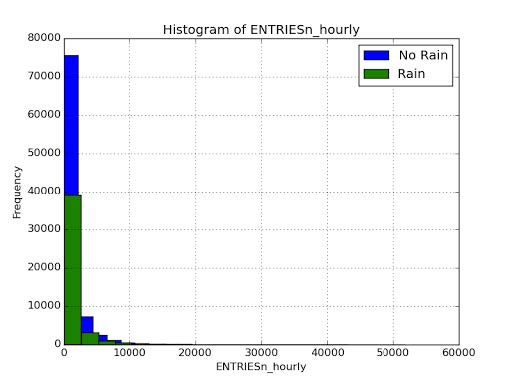
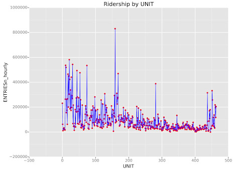

#Analyzing	the	NYC	Subway	Dataset: Predict Ridership in Rainy and Non-rainy Days
by Zhihui Xie

##Overview
In	this	analysis,	I	am	taking	data	from	May	2011	NYC	MTA	Subway	as	provided	in	the	Udacity	'Introduction	to	Data	Science'	class	and	testing	the	hypothesis	that	whether	rainy	days	impacts	ridership.

##Section	1.	Statistical	Test
###### 1. Which	statistical	test	did	you	use	to	analyse	the	NYC	subway	data?
To	analyze the	MTA	subway	data, I	used Mann-Whitney	U-Test.

###### 2. Why	is	this	statistical	test	appropriate	or	applicable	to	the	dataset?
The	 data	 I	 analyzed	 include	 two	 populations:	 ridership	 on	 rainy	 days	 and	ridership	 on	 non-rainy	 days.	 These	 two populations	 have	 possibly	unequal variances	and	sample	size.	Based	on	 the	characteristics	of	 the	data,	Welch's	 t-Test	 or	 Mann-Whitney	 U-Test	 may	 be	 used	 to	 check	 the null	hypothesis that	 the	 mean	 of	 two	 populations	 is the	 same	 against	an alternative	 hypothesis.	 The	 Welch's	 t-Test	 should	 meet	 the	 following	
assumptions:
a. Both	samples	are	drawn	from	normal	population	
b. The	two	samples	are	independent.
Therefore,	 I	 examined	 if	 the	 data	 I	 used	 for	 analysis	 were	 normally	distributed.	First,	the	histograms	for	the	number	of	entries	per	hour	for	days	on	rainy	days	and	non-rainy	days	showed	they	were	not	normal	distribution.	Second,	the	Shapiro-Wilks	test,	which	is	a	test	to	check	if	a sample	came	from	a normally	distributed population,	was	against	the	null	hypothesis	that	 the	 populations	 were	 normally	 distributed	 (p	 <	 0.05).	 Taken	together,	 the	data	did not	meet the	assumptions	 for	Welch's	 t-Test.	Thus,	I chose Mann-Whitney	 U-Test,	 which	 can	 be	 used	 for	 data	 with	 both	 normal	and	non-normal	distribution.

###### 3. What	results	did	you	get	from	this	statistical	test?
To	 do	 the	 test	 for	 an	 alpha	 level	 of	 0.05,	 I	 used	 the	 null	 hypothesis:	 the	ridership	 on	 rainy	 days	 and	 non-rainy	 days	 are	 the	 same.	 The	 alternative	hypothesis	 is:	 the	 ridership	 on	 rainy	 days	 and	 non-rainy	 days	 are	 not	 the	same.	 The	 mean	 of	 ENTRIESn_hourly on	 rainy	 days	 was 1105.45 and	 the	mean	 of	 ENTRIESn_hourly	 on	 non-rainy	 days	 was 1090.28.	 The MannWhitneyU-Test	results	showed	that	the p_value	for	the	test	was	0.025.	

###### 4. What	is	the	significance	of	these	results?
Because	the	p_value	(0.025)	is	less	than	0.05,	I	concluded	that	the	null	hypothesis	was	rejected	and	the	ridership	on rainy	days	and	non-rainy	days	were	significantly	different.	

##Section	2.	Linear	Regression
###### 1. What	approach	did	you	use	to	compute	the	coefficients	theta	and	produce	prediction	in	your	regression	model:
###### a. Gradient	descent	(as	implemented	in	exercise	3.5)
###### b. OLS	using	Statsmodels
###### c. Or	something	different?
The	method	I	tested	for	NYC	subway	data	was	Ordinary	Least	Squares	(OLS)	Linear	Regression	(b,	problem	set3_8).

###### 2. What	features	did	you	use	in	your	model?	Did	you	use	any	dummy	variables	as	part	of	your	features?
In	playing	with	the	features	to	learn	on, I	tested	the correlation	between	ridership	and	the following	features (problem	set3_8):

###### 3. Why	are	these	features	appropriate?
All	features	I	tested can	be	classified	as	3	categories:	1)	time	per	day	(feature:	Hour);	2)	transit	ridership	per	hour	in	a	day	(feature:	EXITSn_hourly);	3)	weather	conditions	(features:	meandewpti,	meanpressurei,	fog,	rain,	meanwindspdi,	meantempi,	precipi).	All	these	features	are	presented	by	numeric	value	and	may	potentially	impact	ridership	of	subway.

###### 4. What	is	your	model’s	R2 (coefficients	of	determination)	value?
I	calculated R2 for	each	feature	(R2(ea)),	combined	features	(R2(co))	and	all	features	(R2(all)).	The	values	for	calculation	was	shown	in	table	3.

###### 5. What	does	this	R2 value	mean	for	the	goodness	of	fit	for	your	regression	model?
The	R2 value	using	all	features	is	0.55,	which	show	a	positive	correlation	between	these	features	and	ridership	in	NYC	subway.	Particularly,	there	is	less	correlation	between	“Hour”	and	ridership	(R2 =	0.017),	high	positive	correlation	between	“EXITSn_hourly”	and	ridership	(R2 =	0.53)	and	negative	correlation	between	each	weather	feature	and	ridership.Do	you	think	this	linear	model	is	appropriate	for	this	dataset,	given	this R2 value?
In	this	test,	the	overall	R2 value	is	0.55,	which	suggests	a	relative	high	correlation	between	features	and	ridership.	Based	on	this	R2 value,	this	linear	model	is	a	good	model	for	this	dataset	and	may	be	served	as	a	predictive	model	for	future	dataset.

##Section	3.	Visualization
###### Please	include	two	visualizations	that	show	the	relationships	between	two	or	more	variables	in	the	NYC	subway	data.	You	should	feel	free	to	implement	something	that	we	discussed	in	class	(e.g.,	scatterplots,	line	plots,	or	histograms)	or	attempt	to	implement	something	more	advanced	if	you'd	like.
###### 1. One	visualization	should	be	two	histograms	of	ENTRIESn_hourly	for	rainy	days	and	non-rainy	days
In	this	visualization,	I	illustrated the	ENTRIESn_hourly	for	rainy	days	and	nonrainy days	(Figure	1).	Overall,	the	frequency	of ENTRIESn_hourly	for	non-rainy	days (blue	bars)	was	higher	than	rainy	days	in	each	range.

##### Figure	1.	The	frequency	of	ENTRIESn_hourly	for	non-rainy	days (blue bar)	and	rainy	days (green	bar)	on	 May	 2011	 (NYC	 subway).	 The	 ENTRIESn_hourly	 was	 shown	 in	 x-axis.	 The	 frequency	 of	ENTRIESn_hourly	was	shown	in	y-axis.	The	 figure	was	plotted	using	ggplot	and	python	with	bins	=	20.	

###### 2. One	visualization	can	be	more	freeform,	some	suggestions	are:
###### a. Ridership	by	time-of-day	or	day-of-week
###### b. How	ridership	varies	by	subway	station
###### c. Which	stations	have	more	exits	or	entries	at	different	times	of	day
For	this	visualization,	I	investigated and	illustrated the	ENTRIESn_hourly	per	UNIT station	(Figure	2).	As	you	can	see	below,	most	of	the	stations	had the	ridership	under 200,000.	Thirteen	stations	had ridership	over	400,000,	and	one	station	had relative	higher	ridership	(over	800,000). 

##### Figure	2.	Ridership	by	unit	stations	on	May	2011 (NYC	subway).	The	index	number	of	unit	stations	was	shown	in	x-axis.	The	ENTRIESn_hourly	(ridership)	was	shown	in	y-axis.	The	figure	was	plotted	using	ggplot	and	python.	The	value	of		ENTRIESn_hourly	was	shown	as	red	points.

##Section	4.	Conclusion
###### Please	address	the	following	questions	in	details,	and	your	answers	should	be	1-2	paragraphs	long.
###### 1. From	your	analysis	and	interpretation	of	the	data,	do	more	people	ride
###### the	NYC	subway	when	it	is	raining	versus	when	it	is	not	raining?	
###### 2. What	analyses	lead	you	to	this	conclusion?
In	this	analysis	I	tested	the	null	hypothesis- the	ridership	on	rainy	days	and	nonrainy days	 are	 the	 same,	and	 an	 alternative	 hypothesis- the	 ridership	 on	 rainy	days	and	non-rainy	days	are	not	the	same	at	an	alpha	level	of	0.05.	I	showed	that	the	mean	of	ENTRIESn_hourly	on	rainy	days	(1105.45) was	slightly	higher	thanthe	mean	of	ENTRIESn_hourly	on	non-rainy	days	(1090.28).	The	Mann-Whitney	U-Test	results	showed	a p_value	of 0.025	(table	2),	which	was	less	than	0.05.	Because	the	p_value (0.025) was	less	than	0.05,	I	concluded	that	the	null	hypothesis	was	rejected	and	the	ridership	on	rainy	days	and	non-rainy	days	were	significantly	different.	Considering	the	mean	of ENTRIESn_hourly	on	rainy	days	was	greater	than	the	mean	of	ENTRIESn_hourly on	non-rainy	days,	the	results	supported that	there	were	more	people	ride	the	NYC	subway	when	it	was	raining	versus	when	it	was	not	raining	on	May	2011.

##Section	5.	Reflection
Please	address	the	following	questions	in	details,	and	your	answers	should	be	1-2	paragraphs	long.
###### 1. Please	discuss	potential	shortcomings	of	the	data	set	and	the	methods of	your	analysis.
There	are		several	pitfalls	of	the	dataset	and	the	methods	used	in	this	analysis:
a. Sample	size- the	dataset	only	included	data	from	May	2011,	increasing sample	size	may	change	the	results	of	analysis	and	conclusions.
b. Other weather	conditions- this	analysis	only	considers	rainy	and	nonrainy condition,	but	other	weather	may	also	impact	ridership.	For	instance,	the	feature	“fog”	shows	a	similar	R2 value	as	feature	“rain”	(table	3).	It	cannot be	excluded	the	possibility	that	those	“fog”	or	“nonfog”days	biased	the	results	of	analysis	based	on	rainy	days	and	nonrainy days.	To	overcome	this	shortcoming,	more	detailed	comparisons	should	be	used,	e.g.	comparisons	between	“rain	and	non-fog”	and	“non-rain	and	non-fog”,	comparisons	between	 “rain	and	fog”	and	“non-rain	and	fog”.
c. Different	months	may	have different number	of	rainy	days,	but	this dataset	only	included	data	on May.	Thus,	the	number	of	rainy	days	or	non-rainy	days	may	be	biased.	To	improve	this,	the	data	from	the	whole	year	should	be	included	for	analysis.

###### 2. (Optional)	Do	you	have	any	other	insight	about	the	dataset	that	you	would	like	to	share	with	us?
I	am	interested	in	investigating	how	temperature	affects	ridership.	I	compared	the	ridership	when	temperature	was	below	or	above	70 oF		or	75	oF.	The	data	showed	that: 1)	there	was	no	significantly	difference	between	ridership	with	temperature	lower	than	or	equal	to	70	and ridership	with	temperature	higher	than	70. 2)	there	was	significantly	more	ridership	when	temperature	was	lower	than	or	equal	to	75	as	compared	with	ridership	when	temperature	was	high	than	75.

## References:
[Intro	to	Data	Science (Udacity)](https://www.udacity.com/course/ud359)

[Intro	to	Statistics (Udacity)](https://www.udacity.com/course/st101)

[Shapiro–Wilk	test	- Wikipedia,	the	free	encyclopedia](http://en.wikipedia.org/wiki/Shapiro–Wilk_test)

[Mann-Whitney	U-test	/	Mann-Whitney-Wilcoxon	- Explorable](https://explorable.com/mann-whitney-u-test)
