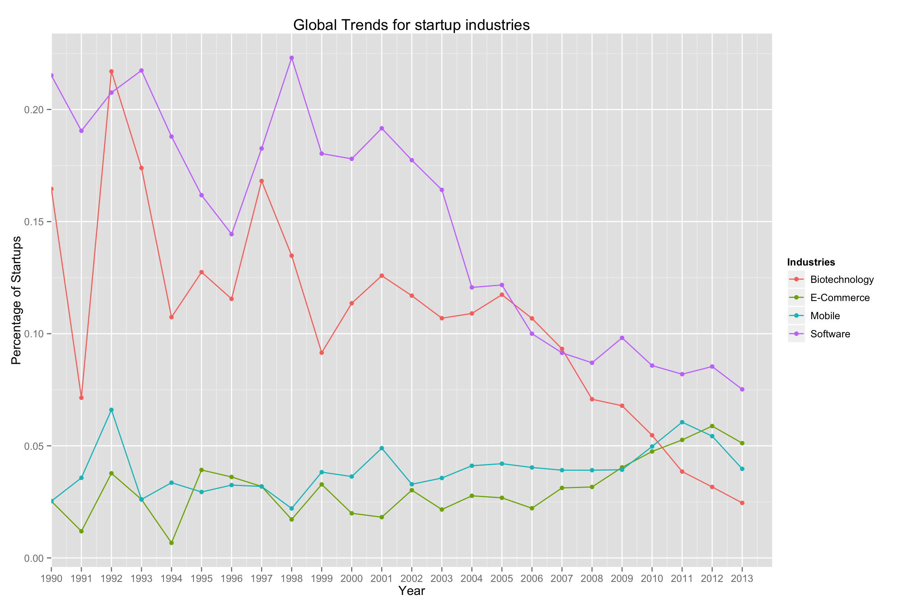
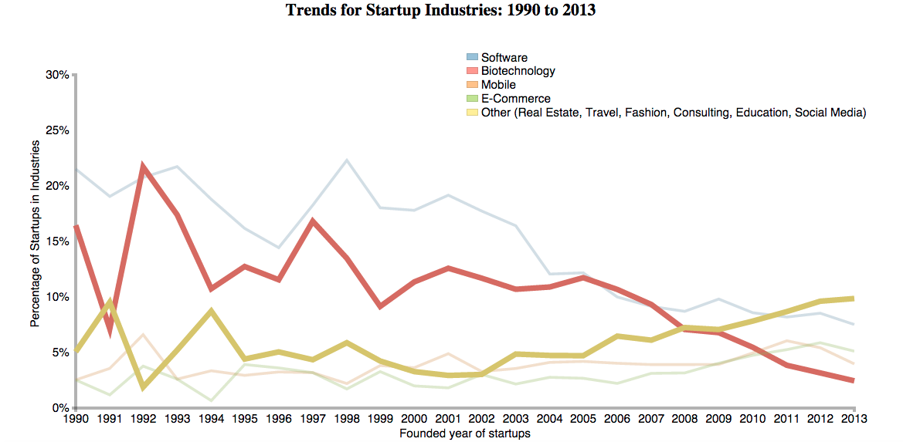

# Make Effective Data Visualization: Trends for Startup Industries: 1990 to 2013
#### by Zhihui Xie
## Summary
This data visualization is going to explore trends of hot startup industry from 1990 to 2013. The dataset was downloaded from CruchBase (https://info.crunchbase.com/about/crunchbase-data-exports/).
## Design
### Data Cleaning and Exploratory
The hypothesis of the design is the quantity or the percentage of startups may be different across different industries over time. To test the hypothesis, I first removed invalid data points in “market” and “founded_year” column using Rstudio. Then, I did the first exploration with all industries across all years in the data set:
 
This visualization contains too much information. The line chart was cluttered and it’s hard to get the effective comparisons. Therefore, the data were truncated and focused on hot industries (with number of startups greater than 1400) from 1990 to 2013. I did the second exploration as shown below:
 
This chart shows trends of increase of new founded startups in all industries from 1990 to 2007. The increases reach a peak in 2012 for software and E-commerce, then drop down. For biotechnology, the quantity of new founded startups decreased in 2008, increased in 2009-2010, and then dropped down quickly from then on. For mobile, the quantity of new founded startups decreased from 2011.

The chart above somehow reflects the trends of quantity of new founded startups in each industry over time. However, the total number of new founded startups also changed overtime. So, it’s important to compare the trends of occupied percentage of startups in industry. To do that, I did the third exploration: 
 
This new chart displays the trends of relative percentage of startups in industries, which addresses the question - what are the trends for startups over time. 
Finally, I loaded the exploration results to “clean_data_R” fold and exported the truncated data.
### Data Visualization 
Using the cleaned data, I decided to creat a new chart with D3.js and dimple.js. I tried several different charts: line chart, scatter chart, bubble chart, area and bar charts. Among these charts, I noticed that the line chart (represents change of percentage of startup industry) combined with the scatter chart (represents number of startups) clearly represented the changes of percentage of startups in industries over time. But the circles in scatter chart are too dense in some area of the chart. Thus, I set "opacity" as zero for circles. To improve the chart, I also did the following adjustments: 1) used different colors to distinguish industries from each other; 2) format x and y-axes and add title for axes; 3) add title for the chart on top center; 4) add legend to indicate each industry; 5) add a mouse click event to highlight individual market. The initial chart was shown as below:

 
## Feedback
#### Interview #1
###### I quickly noticed the biotechnology was shrunk dramatically over time.  

###### I feel the mouse click event is awesome, but the line is too thin and hard to click it in a right way to highlight. 

###### I think the main takeaway is that percentage of these startups is decreasing.

#### Interview #2
###### I relized that this is an interactive graph and really like to move mouse over differet time period to see the detailed information. Include number of startups in the interactive graph is very informative since the trends of number of startups and percentage of startups in industries are different.

###### The main idea I gain was these hot startups decreased from 1990 to 2013. While, the open question is which startups are increased as compared to other startups. 

#### Interview #3
###### The highlight on biotechnology gave me a clear idea how this industry of startups occupied porportion changed across time. I think it will be better if you can select and highlight two or more industries for comparisons in the final plot.

###### In addition, though it's a challenge question, it's interesting and important to explore other industries that have increasing trends.

## Final Design
In responding to comments from the interviews, I improved the chart with the following modifications:
1) Set style for all path with increase of "stroke-width";
2) To explore industries with increasing trends are challenge because there are many new emerged small industries with increasing trends, adding these industries will make the visualization too complex. To partially address this issue, I focused on industries with number of startups greater than 300. Then, I examined the changes of percentage of these industries overtime and found the following industries with increased trends: Real Estate, Travel, Fashion, Consulting, Education, Social Media. To simplify the graph, these industries are classified as "Other".
3) Two typical trends were highlighted in the final plot: biotechnology and other. 
The final chart of the data visualization is shown below:
 
The final code includes "index_final.html", "css/style_final.css", "js/myChart_final.js". 

## Discussion
The dataset was downloaded from CruchBase. There might be some limitations for this dataset. For example, the data are incomplete as many startups are not collected or reported in the system, or the classifications of industries are not completely correct. Even though, the trends shown here are still meaningful considering the data in the system are not totally biased.

## Resources
[CrunchBase](https://www.crunchbase.com/)

[Exploratory Data Analysis Using R (Udacity)](https://www.udacity.com/course/ud651)

[Data Visualization and D3.js (Udacity)](https://www.udacity.com/course/ud507)

[Dimple.js Documentation](dimplejs.org/)

[Stackoverflow](stackoverflow.com/)
