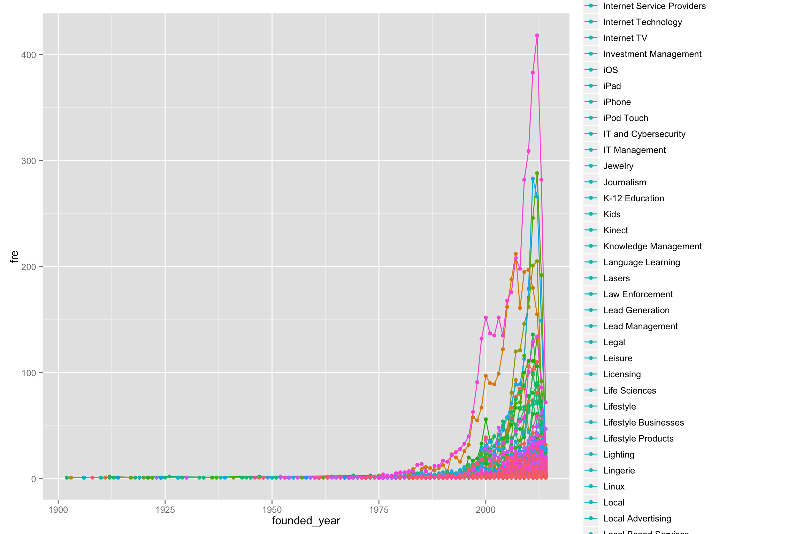

# Make Effective Data Visualization: Global Trends for Startup Markets: 1990 to 2014
#### by Zhihui Xie
## Summary
This data visualization shows global trends of 6 startup market (Software, Biotechnology, Mobile, E-Commerce, Social Media and Real Estate) share from 1990 to 2014.  The data was collected from CruchBase (https://info.crunchbase.com/about/crunchbase-data-exports/).
## Design
### Data Cleaning and Exploratoration
The hypothesis of the design is the quantity or the market share of startups may be different across different markets over time. To test the hypothesis, I first removed invalid data points in “market” and “founded_year” column using Rstudio. Then, I did the first exploration with all markets across all years in the data set:
 
This visualization contains too much information. The line chart was cluttered and it’s hard to get the effective comparisons. Therefore, the data were truncated and focused on hot markets from 1990 to 2014. I did the second exploration as shown below:
 
This chart shows trends of increase of new founded startups in all markets from 1990 to 2007. The increases reach a peak in 2012 for software, E-commerce and social media markets, then drop down. For biotechnology market, the quantity of new founded startups decreased in 2008, increased in 2009-2010, and then dropped down quickly from then on. For mobile and real estate market, the quantity of new founded startups decreased from 2012 and 2013, respectively.

The chart above somehow reflects the trends of quantity of new founded startups in each market over time. However, the total number of new founded market also changed overtime. So, it’s important to compare the trends of market share of startups. To do that, I did the third exploration: 
 
This new chart displays the trends of relative market share for startups, which addresses the question - what are the trends for startup markets over time. 
Finally, I loaded the exploration results to “clean_data_R” fold and exported the truncated data to “data” fold.
### Data Visualization 
Using the cleaned data, I decided to creat a new chart with D3.js and dimple.js. I tried several different charts: line chart, scatter chart, bubble chart, area and bar charts. I noticed that the line chart combined with the scatter chart clearly represented the changes of each market over time. But, the overall trends and comparisons among markets in a given year is not clear. Thus, I considered using a combination of bar chart and area chart. The bar chart is good to reflect the market share for each market in a certain year. The area chart displays the trend of market share over time. To improve the chart, I did the following adjustments: 1) used different colors to distinguish markets from each other; 2) format x and y-axes and add title for axes; 3) add title for the chart on top center; 4) add legend to indicate each market; 5) add a mouse event to highlight individual market. The initial chart was shown as below:

 
## Feedback
#### Interview #1
###### I quickly noticed the biotechnology market was shrunk dramatically. Highlight one market is really helpful to draw attention. 

###### I feel the font size of x-, y-labels and legends is too small and hard to see. It will be better if the font size is bigger. 

###### I think the main takeaway is that the market share of these startups is decreasing.

#### Interview #2
###### I noticed that this was an interactive graphic. I really like the way to highlight area for individual market when mouse was on that area.

###### For the layout, I think the title is too close to the top of the page. Also, the grid lines seems to interfere the visualization.

###### When I looked into the chart, the main idea I got was the startup markets were shrunk from 2005 to 2014. 

###### Overall, the chart is very clear and easy to understand. 

#### Interview #3
###### The emphasis on biotechnology market showed a clear trend of this startup market over time. I think it will be better if you can select and highlight two or more markets for comparisons.

###### I noticed that the quantity of 5 markets were decreased and only the real estate market was increased. It will be interesting to find out other markets that also have increasing trends.

## Final Design
In responding to comments from the interviews, I improved the chart with the following modifications:
1) Set and increases font size of x, y and legend labels (myChart1.js);
2) Increased space between title and the top of page (style_final.css);
3) Muted the grid lines (myChart2.js);
4) Removed “mouseover” and “mouse out” events. Applied “click” (to show area) and “dblclick” (to hide area) events to highlight two of more area (myChart_final.js and index_final.html).
5) Edited title.

I did not include other markets with increasing trends because of the following two reasons: 1) this visualization focused on hot startup markets; 2) there are many new emerged small markets with increasing trends, adding these markets which will make the visualization too complex.
The final chart of the data visualization is shown below:
 
The final code includes "index_final.html", "css/style_final.css", "js/myChart_final.js". 

## Resources
[CrunchBase](https://www.crunchbase.com/)

[Exploratory Data Analysis Using R (Udacity)](https://www.udacity.com/course/ud651)

[Data Visualization and D3.js (Udacity)](https://www.udacity.com/course/ud507)

[Dimple.js Documentation](dimplejs.org/)

[Stackoverflow](stackoverflow.com/)
