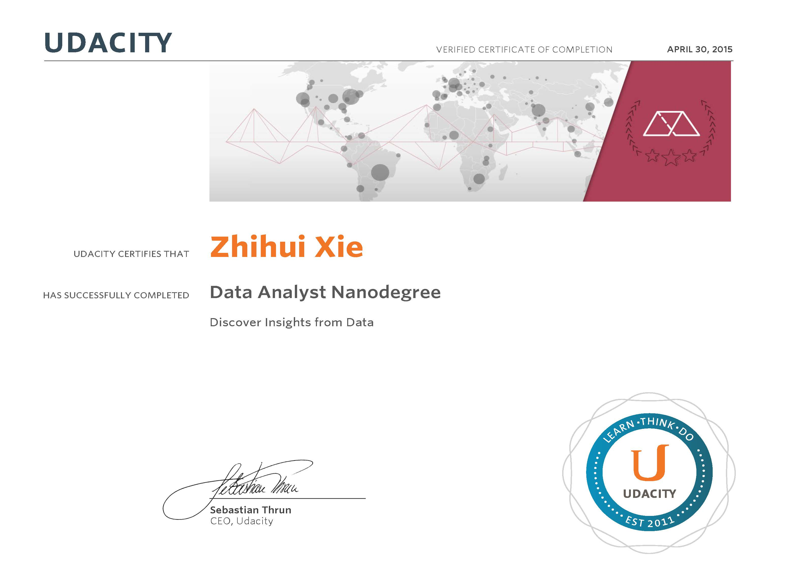

# Data Aanlyst Nanodegree (Udacity)

 

##Projects:

###Project1- Analyzing the NYC Subway Dataset: Predict Ridership in Rainy and Non-rainy Days
In this analysis, I used ridership data generated in May 2011 New York city (NYC) MTA Subway and weather data generated at the same time and the same region to test the hypothesis that whether rainy days impacts ridership of NYC subway.

###Project2- Data Wrangle OpenStreetMaps: Improve OpenStreetMaps in Las Vegas
OpenStreetMap, an open project to create a free map around the world, is a powerful tool for viewing maps and humanitarian aid. The initial data of the map were collected using a handheld GPS and a notebook, digital camera, or a voice recorder. These data heavily rely on the human input, which may cause inconsistent input, misspellings or error (e.g. inconsistent input of Street, street, st., St.). This project is going to focus on map of Las Vegas, Nevada, USA and wrangling the data: 1) overview data (code: mapparser.py); 2) check the “k” value for each “” (code: tags.py); 3) find out number of unique users contributed to the map (code: users.py); 4) fix unexpected street types (e.g. street, st., St. to be Street) (code: audit.py); 5) transform the shape of data and insert data into mongodb (code: data.py and mongodb.py); 6) use MongoDB queries to find number and names of hotels, and shopping malls (code: query.by).

###Project3- Explore and Summarize Data: Insight into Startups
The startups, generally newly created, are in a phase of development and research for markets.It’s important for both investors and entrepreneurs to understand characteristics of startups such as what are hot markets, where are hot regions and when are hot seasons for investments. To explore that, data of startups from 1990 to 2014 in US were used and analyzed in this project (collected by CruchBase (https://info.crunchbase.com/about/crunchbase-data-exports/)).

###Project4- Machine Learning: Identifying Fraud from Enron Email
Enron Corporation, which was one of the largest companies in the United States in 2000, was an American energy, commodities, and Services Company. In 2002, Enron had filed for bankruptcy because of accounting fraud. In the following federal investigation, a large database of over 600,000 emails generated by 158 employees of Enron was acquired. Subsequently, a copy of the database was purchased and released to public by Andrew McCallum. The dataset was used widely for machine learning studies. In this project, I built a machine learning model using “scikit-learn” built-in algorithm to predict a “person of interest” (“poi”), who may be involved in fraud in Enron.

###Project5- Make Effective Data Visualization: Trends for Ten Hot Startup Industries: 1990 to 2013
In this project, I analyzed the trends for ten startup industries from 1990 to 2013 with data from CrunchBase. It's interesting to find that the percentages of startups by industry changed overtime in the visualization of time-series chart. In general, two dominant industries - software and biotechnology, tend to shrink from 90s to 00s, and startups in new industries including social media, e-commerce and mobile increased. These trends are more obvious by comparing mean of percentages of startups by industry between two time periods: 1990 - 1999 and 2000 - 2013. Compared with 90s, the percentage of startups in software, biotechnology and consulting decreased. While, the percentage of startups in new emeraged industries including social media, mobile and e-commerce increased. These trends fit well with development of industries and economy. In 90s, the available of internet to most of people and increase of investment in biomedical research boosted startups founded in software and biotechnology. Then, internet bubble crash and regression of economy in 00s caused decrease of percentage of startups in these two industries. Simultaneously, startups in new industries started to emerge. For example, Facebook (social media industry) founded in 2004, and smart phones (mobile industry) became popular in 2007. Although the percentage of startups in software and biotechnology declined, the number of startups still increased in 00s as compared to 90s. At the same time, there is a faster increase of total number of startups in other industries and new emerged industries, which results in decrease of percentage of startups in software and biotechnology.
The data was collected from [CruchBase](https://info.crunchbase.com/about/crunchbase-data-exports/).

##Courses:

[Intro to Data Science](https://www.udacity.com/course/ud359)

[Data Wrangling with MongoDB](https://www.udacity.com/course/ud032)

[Exploratory Data Analysis Using R](https://www.udacity.com/course/ud651)

[Intro to Machine Learning](https://www.udacity.com/course/ud120)

[Intro to HTML&CSS](https://www.udacity.com/course/ud304)

[Javascript Basic](https://www.udacity.com/course/ud804)

[Data Visualization and D3.js](https://www.udacity.com/course/ud507)
